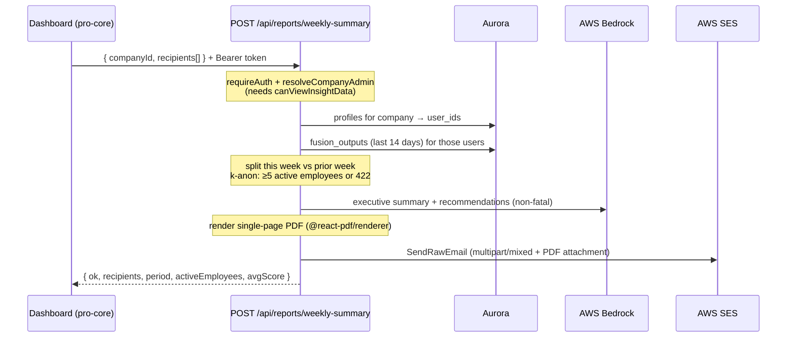

# Reporting

Mind Measure Pro produces three distinct reports. They are deliberately separate surfaces with different audiences, data sources, and privacy models. This page is the technical reference; the user-facing walkthrough lives in the [Pro Employer Handbook](/handbook-pro#11-reporting).

| Report | Who triggers it | Scope | Where it lives |
|---|---|---|---|
| **Weekly summary** | Company admin/manager/viewer | Whole company, last 7 days | `POST /api/reports/weekly-summary` (pro-core) |
| **Individual wellbeing report** | The employee, in the mobile app | One employee's own history | `POST /api/reports/generate` (pro-core) |
| **Cohort insight report** | Insight Hub user | Two to six question cohorts | `POST /api/companies/cohort-insight-report` (pro-core) |

All three render a PDF and all three enforce the platform's minimum group size of five before any aggregated figure is shown. None of them ever expose an individual's score or conversation to the employer.

> **Pro only, for now.** The weekly summary is built for Pro first. University parity is a separate follow-on; the University reflection/newsletter path is documented under [Operations](/operations/weekly-reflection).

---

## Weekly summary

An on-demand, one-page executive summary of the previous seven days of company wellbeing, emailed as a PDF to a recipient list. It reuses the same aggregates the dashboard shows, adds a week-on-week movement, and wraps them in an AI-written narrative.

It is **on demand, not scheduled**, and **company-wide, not segmented**: one summary for the whole organisation, no cohorts.

### Trigger

The **Email weekly summary** button sits under the *Wellbeing overview* hero on the dashboard Overview (`WeeklySummaryDialog` in `mind-measure-pro-core/src/components/institutional/`). It opens a dialog that collects recipients (comma-separated; blank sends to the caller's own login email) and posts to the endpoint with the caller's bearer token.

### Flow

### Authorisation

`requireAuth` then `resolveCompanyAdmin`. Any role that can read the dashboard may send a summary: **admin, manager, viewer, insight_only** (the `canViewInsightData` capability). `content_only` cannot. Mind Measure staff (super admin) can send for any company. The company is resolved by UUID **or** slug, so the endpoint is tolerant of either identifier.

### Data sources & aggregation

The endpoint pulls the company's employees from `profiles` (by `company_id`), then their `fusion_outputs` over the last 14 days, and splits the rows into **this week** (last 7 days) and the **prior week** (days 7–14) for the delta. It mirrors the dashboard's own calculations exactly:

| Figure | Source |
|---|---|
| Average score + band | mean of `fusion_outputs.final_score` this week; bands Excellent 80+, Good 60–79, Moderate 45–59, Concerning < 45 |
| Week-on-week delta | this week's average minus the prior week's (null if no prior data) |
| Distribution | share of scores in each band, this week |
| Active employees | distinct `user_id` with a check-in this week |
| Check-ins | row count this week |
| Average mood | `analysis.mood_score` (falling back to `mood_self_report.score` / `clinical_scores.mood_scale`), 0–10 |
| Top positive themes | most frequent `analysis.driver_positive` values, top 5 |
| Top concern themes | most frequent `analysis.driver_negative` values, top 5 |

### Privacy (k-anonymity)

Before anything is rendered or sent, the endpoint counts **distinct active employees this week**. If that is below `AUDIENCE_MIN_FLOOR` (five), it returns **422** with a plain-English message and sends nothing. This is the same floor the Insight Hub and the Alerts system use, and it is enforced server-side so it cannot be bypassed from the client.

### Narrative (Bedrock)

A single Bedrock pass (Claude, via the shared `BEDROCK_TEXT_MODEL` constant) writes a short executive summary paragraph and two to three recommendations from the aggregated figures only; no individual data is ever sent to the model. Both calls are **non-fatal**: if Bedrock is unavailable the report still renders with the numbers and themes, just without the prose.

### PDF & email

The document is a single on-brand A4 page built with `@react-pdf/renderer` in `api/_lib/weekly-summary-pdf.ts`. It is written with `React.createElement` rather than JSX so the helper stays a plain `.ts` module: the API typecheck (`tsconfig.api.json`) only includes `.ts` files and has no JSX configuration, and API code must not import from `src`.

The PDF is attached to a `multipart/mixed` MIME message sent via SES `SendRawEmailCommand`, from `noreply@mindmeasurepro.com`. Recipients are validated, de-duplicated, capped at 25, and default to the caller's own email when none are supplied.

The function is given `maxDuration: 60` for Bedrock and PDF render headroom.

---

## Individual wellbeing report

The report an **employee** generates for themselves from the mobile app, covering their recent check-in history. The employer never triggers or sees it. It is documented in full under [Downloadable Wellbeing Reports](/planning/completed/downloadable-wellbeing-reports).

In pro-core it is served by `POST /api/reports/generate` (creates a tokenised, time-limited link and emails it) and `GET /api/reports/[reportId]` (assembles the data and an AI summary on demand). The report header shows the employee's company name (loaded live from `companies`) and **seniority**; data is aggregated from `fusion_outputs` and the assessment tables, with the AI summary written by Bedrock. A baseline assessment is required before a report can be generated.

---

## Cohort insight report

The leadership-facing report run from the **Insight Hub**, comparing how two to six cohorts answered a single Conversational Insight question, with an AI narrative and recommended actions. It is documented under the [Insight Hub](/insight-hub/architecture). Served by `POST /api/companies/cohort-insight-report`, it matches cohorts against the response `cohort_snapshot` (never the live profile), clamps each cohort to the k-anon floor, and degrades gracefully if any Bedrock call fails.

---

## Removed: CMS "Reports Configuration"

An earlier CMS tab let admins build report "templates" but had no generation engine behind it: it saved configuration that nothing consumed, and its copy was carried over from the University product. It was removed (May 2026) along with its dead components (`ReportsManager`, `ReportsAnalytics`, `ReportsAnalyticsConfig`). The weekly summary replaces the use case it was gesturing at.
