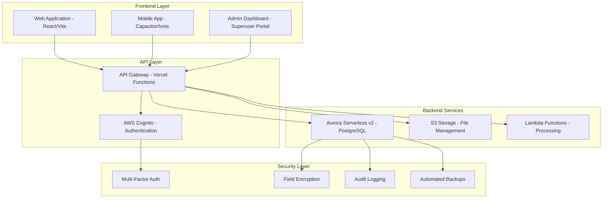
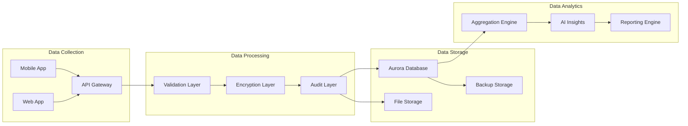

# System Architecture

Mind Measure is built on a modern, scalable architecture designed for enterprise-grade mental health monitoring in educational institutions.

## High-Level Architecture

## Core Components

### Frontend Applications

#### Web Application
- **Technology**: React 18 + Vite + TypeScript
- **Styling**: Tailwind CSS with custom Mind Measure theme
- **State Management**: React Context + Custom hooks
- **Routing**: React Router with protected routes
- **Deployment**: Vercel with automatic deployments

#### Mobile Application
- **Technology**: Capacitor + Ionic React
- **Platforms**: iOS and Android native apps
- **Offline Support**: Local storage with sync capabilities
- **Push Notifications**: Native notification system
- **App Store**: Distributed through official app stores

#### Admin Dashboard
- **Superuser Portal**: Complete system administration
- **University Dashboards**: Institution-specific management
- **Security Console**: Real-time security monitoring
- **CMS Interface**: Content management system

### Backend Infrastructure

#### Database Layer
- **Primary Database**: AWS Aurora Serverless v2 (PostgreSQL)
- **Auto-scaling**: 0.5 to 16 ACUs based on demand
- **High Availability**: Multi-AZ deployment with 99.99% uptime
- **Backup Strategy**: Automated daily backups with point-in-time recovery
- **Encryption**: At-rest and in-transit encryption

#### Authentication & Authorization
- **Service**: AWS Cognito User Pools
- **Multi-Factor Authentication**: TOTP and SMS support
- **Role-Based Access Control**: Granular permission system
- **Session Management**: Secure token-based authentication
- **Password Policy**: Enterprise-grade password requirements

#### File Storage
- **Service**: AWS S3 with intelligent tiering
- **Encryption**: Server-side encryption with KMS
- **Access Control**: Pre-signed URLs for secure access
- **CDN**: CloudFront for global content delivery
- **Backup**: Cross-region replication

## Security Architecture

### Medical-Grade Security Implementation

#### Data Protection
- **Field-Level Encryption**: PHI data encrypted at the field level
- **Key Management**: AWS KMS with automatic key rotation
- **Data Classification**: Automated PII/PHI identification
- **Data Minimization**: Only necessary data collected and stored

#### Access Control
- **Zero Trust Model**: Every request authenticated and authorized
- **Role-Based Permissions**: Granular access control system
- **Session Security**: Secure session management with timeout
- **API Security**: Rate limiting and request validation

#### Compliance Framework
- **HIPAA Compliance**: Full Business Associate Agreement compliance
- **GDPR Compliance**: EU data residency and privacy rights
- **SOC 2 Type II**: Comprehensive security controls audit
- **ISO 27001**: Information security management system

### Security Monitoring

#### Audit Logging
- **Comprehensive Logging**: All user actions and system events
- **Real-time Monitoring**: Automated threat detection
- **Log Retention**: 7-year retention for compliance
- **SIEM Integration**: Security information and event management

#### Vulnerability Management
- **Automated Scanning**: Daily vulnerability assessments
- **Penetration Testing**: Quarterly third-party security testing
- **Dependency Scanning**: Automated library vulnerability checks
- **Security Patches**: Automated security update deployment

## Data Architecture

### Data Flow

### Database Schema

#### Core Tables
- **Users**: Student and admin user accounts
- **Profiles**: Extended user profile information
- **Assessments**: Daily check-in responses
- **Fusion Outputs**: AI-processed wellbeing scores
- **Universities**: Institution configuration
- **Resources**: Mental health resources and contacts

#### Security Tables
- **Audit Logs**: Comprehensive activity logging
- **Security Incidents**: Automated threat detection records
- **Access Tokens**: Secure session management
- **Encryption Keys**: Field-level encryption key management

#### Analytics Tables
- **Aggregated Metrics**: Privacy-preserving analytics
- **Trend Analysis**: Historical wellbeing trends
- **Risk Indicators**: Early intervention triggers
- **Compliance Reports**: Automated compliance reporting

## Deployment Architecture

### Production Environment

#### Frontend Deployment
- **Platform**: Vercel with global CDN
- **Domain**: app.mindmeasure.co.uk
- **SSL**: Automatic HTTPS with certificate management
- **Performance**: Edge caching and optimization
- **Monitoring**: Real-time performance monitoring

#### Backend Deployment
- **Region**: EU-West-2 (London) for GDPR compliance
- **Infrastructure**: AWS with Infrastructure as Code
- **Scaling**: Auto-scaling based on demand
- **Monitoring**: CloudWatch with custom metrics
- **Alerting**: Automated incident response

### Development Environment

#### Local Development
- **Database**: Local PostgreSQL with test data
- **Authentication**: Development Cognito pool
- **File Storage**: Local file system
- **API**: Local development server
- **Hot Reload**: Instant development feedback

#### Staging Environment
- **Purpose**: Pre-production testing and validation
- **Data**: Anonymized production data subset
- **Security**: Production-equivalent security controls
- **Testing**: Automated integration testing
- **Approval**: Required for production deployment

## Performance & Scalability

### Performance Optimization

#### Frontend Performance
- **Code Splitting**: Lazy loading of components
- **Bundle Optimization**: Tree shaking and minification
- **Caching Strategy**: Aggressive caching with cache invalidation
- **Image Optimization**: Automatic image compression and WebP
- **Performance Monitoring**: Real-time performance metrics

#### Backend Performance
- **Database Optimization**: Query optimization and indexing
- **Connection Pooling**: Efficient database connection management
- **Caching Layer**: Redis for frequently accessed data
- **API Optimization**: Response compression and pagination
- **Load Balancing**: Automatic traffic distribution

### Scalability Design

#### Horizontal Scaling
- **Stateless Design**: No server-side session storage
- **Microservices**: Loosely coupled service architecture
- **Auto-scaling**: Automatic resource scaling based on demand
- **Load Distribution**: Geographic load balancing
- **Database Scaling**: Aurora auto-scaling capabilities

#### Vertical Scaling
- **Resource Optimization**: Efficient resource utilization
- **Performance Tuning**: Continuous performance optimization
- **Capacity Planning**: Proactive capacity management
- **Cost Optimization**: Intelligent resource allocation
- **Monitoring**: Comprehensive performance monitoring

## Integration Architecture

### External Integrations

#### University Systems
- **Student Information Systems**: Secure data exchange
- **Learning Management Systems**: Integration capabilities
- **Identity Providers**: SSO integration support
- **Notification Systems**: Email and SMS integration
- **Reporting Systems**: Automated report generation

#### Third-Party Services
- **AI/ML Services**: External AI processing capabilities
- **Analytics Platforms**: Advanced analytics integration
- **Monitoring Services**: External monitoring and alerting
- **Backup Services**: Third-party backup solutions
- **Security Services**: External security scanning

### API Architecture

#### RESTful APIs
- **Design**: RESTful API design principles
- **Documentation**: Comprehensive API documentation
- **Versioning**: Semantic API versioning
- **Rate Limiting**: API usage controls
- **Authentication**: OAuth 2.0 with JWT tokens

#### GraphQL APIs
- **Flexible Queries**: Client-specific data fetching
- **Real-time Updates**: Subscription-based updates
- **Type Safety**: Strong typing with schema validation
- **Performance**: Efficient data fetching
- **Developer Experience**: Excellent tooling support

---

This architecture provides a robust, secure, and scalable foundation for the Mind Measure platform, ensuring reliable mental health monitoring and support for educational institutions.
