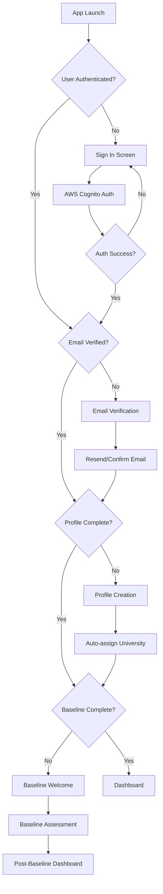

# Mobile App

# Mind Measure Mobile Application

## Overview

The Mind Measure mobile application is a React-based Progressive Web App (PWA) built with Capacitor for native iOS and Android deployment. It provides students with a secure, intuitive platform for mental health assessments, wellbeing monitoring, and support resource access.

## Architecture

### Technology Stack

```yaml
Frontend Framework: React 18 with TypeScript
Build Tool: Vite 6.3.5
Mobile Framework: Capacitor 6.x
UI Library: Tailwind CSS + shadcn/ui
State Management: React Context API
Authentication: AWS Amplify + Cognito
Database: Aurora Serverless v2 (via API)
AI Integration: ElevenLabs Conversational AI
```

### Application Structure

```
src/
├── components/
│   ├── mobile/           # Mobile-specific components
│   │   ├── BaselineAssessment.tsx
│   │   ├── MobileDashboard.tsx
│   │   ├── CheckInAssessment.tsx
│   │   └── BuddySystem.tsx
│   ├── institutional/    # University admin components
│   └── shared/          # Shared components
├── contexts/
│   ├── AuthContext.tsx  # Authentication state
│   └── ServiceContext.tsx # Backend service management
├── services/
│   ├── amplify-auth.ts  # AWS Cognito integration
│   └── database/        # Database services
├── hooks/
│   ├── useDashboardData.ts
│   └── useAuth.ts
└── styles/
    ├── index.css        # Global styles
    └── components.css   # Component styles
```

## User Experience Flow

### Authentication Flow



### Assessment Flow

#### Baseline Assessment
```typescript
// Baseline assessment process
interface BaselineAssessmentFlow {
  1: 'Welcome Screen';           // Introduction and consent
  2: 'Permission Requests';      // Camera/microphone permissions
  3: 'ElevenLabs Widget Setup';  // AI conversation initialization
  4: 'Conversation Phase';       // 6-question structured assessment
  5: 'Data Processing';          // Multi-modal AI analysis
  6: 'Score Calculation';        // Fusion algorithm
  7: 'Results Display';          // Post-baseline dashboard
}
```

**ElevenLabs Integration**
```typescript
// ElevenLabs widget configuration
const widgetConfig = {
  agentId: 'agent_9301k22s8e94f7qs5e704ez02npe',
  autoStart: false,
  conversationMode: 'voice',
  language: 'en',
  voiceSettings: {
    stability: 0.5,
    similarityBoost: 0.75,
    style: 0.0,
    useSpeakerBoost: true
  }
};

// Conversation event handling
widget.addEventListener('conversation-started', (event) => {
  console.log('🎯 Conversation started:', event);
  setConversationData(prev => ({
    ...prev,
    startTime: Date.now()
  }));
  startVisualAnalysis(); // Begin camera frame capture
});

widget.addEventListener('conversation-ended', (event) => {
  console.log('🔚 Conversation ended with data:', event);
  const { transcript, duration, metadata } = event.detail;
  setConversationData(prev => ({
    ...prev,
    transcript: transcript || prev.transcript,
    duration: duration || prev.duration,
    endTime: Date.now()
  }));
  handleConversationEnd(); // Process multi-modal data
});
```

**Multi-Modal Data Capture**
```typescript
// Visual analysis with camera frames
const startVisualAnalysis = () => {
  const captureFrame = () => {
    if (videoRef.current && canvasRef.current) {
      const video = videoRef.current;
      const canvas = canvasRef.current;
      const context = canvas.getContext('2d');
      
      canvas.width = video.videoWidth;
      canvas.height = video.videoHeight;
      context?.drawImage(video, 0, 0);
      
      const imageData = canvas.toDataURL('image/jpeg', 0.8);
      setImageData(imageData);
      
      // Send to Rekognition for emotion analysis
      analyzeFrame(imageData);
    }
  };
  
  // Capture frames every 2 seconds during conversation
  const interval = setInterval(captureFrame, 2000);
  setFrameCaptureInterval(interval);
};

// Audio analysis data extraction
widget.addEventListener('audio-data', (event) => {
  if (event.detail) {
    setAudioAnalysisData(prev => ({
      ...prev,
      speechRate: event.detail.speechRate || prev.speechRate,
      voiceQuality: event.detail.quality || prev.voiceQuality,
      emotionalTone: event.detail.emotion || prev.emotionalTone
    }));
  }
});
```

**AI Analysis Pipeline**
```typescript
// Parallel analysis execution
const handleConversationEnd = async () => {
  try {
    // Create assessment session
    const sessionResult = await backendService.insert('assessment_sessions', {
      user_id: user.id,
      assessment_type: 'baseline',
      status: 'processing',
      session_data: conversationData
    }, 'id');
    
    const sessionId = sessionResult?.data?.id;
    
    // Execute parallel analysis
    const [audioResult, visualResult, textResult] = await Promise.allSettled([
      backendService.functions.invoke('analyze-audio', {
        sessionId,
        audioData: {
          conversation_duration: actualDuration,
          speech_rate: audioAnalysisData.speechRate,
          voice_quality: audioAnalysisData.voiceQuality,
          emotional_tone: audioAnalysisData.emotionalTone,
          mood_score_1_10: conversationData.moodScore,
          transcript_length: conversationData.transcript?.length || 0
        }
      }),
      backendService.functions.invoke('analyze-visual', {
        sessionId,
        imageData: imageData || '',
        visualSummary: {
          samples_captured: visualAnalysisData.rekognitionSamples.length,
          face_detection_rate: visualAnalysisData.faceDetectionRate,
          avg_brightness: visualAnalysisData.avgBrightness,
          quality_score: visualAnalysisData.qualityScore,
          engagement_level: visualAnalysisData.faceDetectionRate > 0.7 ? 'high' : 'moderate'
        }
      }),
      backendService.functions.invoke('analyze-text', {
        sessionId,
        conversationText: conversationData.transcript
      })
    ]);
    
    // Calculate fusion score
    const fusionResult = await backendService.functions.invoke('calculate-mind-measure', {
      sessionId
    });
    
    // Navigate to post-baseline dashboard
    setAppState('dashboard');
    
  } catch (error) {
    console.error('Assessment processing failed:', error);
    // Graceful fallback with provisional scoring
  }
};
```

#### Check-In Assessment
```typescript
// Regular check-in flow (more conversational)
interface CheckInAssessmentFlow {
  1: 'Dashboard Access';         // From main dashboard
  2: 'Check-In Welcome';         // Brief introduction
  3: 'Conversational Assessment'; // Open-ended conversation
  4: 'Mood Tracking';            // Self-reported mood scale
  5: 'Analysis Processing';      // Same AI pipeline
  6: 'Results Integration';      // Update dashboard with trends
}
```

### Dashboard Experience

#### Post-Baseline Dashboard
```typescript
// Specialized post-baseline view
const PostBaselineDashboard: React.FC = () => {
  const { profile, latestSession, isPostBaselineView } = useDashboardData();
  
  return (
    <div className="min-h-screen bg-gradient-to-br from-blue-50 to-indigo-100">
      {/* University Branding */}
      <motion.div variants={itemVariants} className="pt-4">
        <div className="flex items-center justify-center gap-3 mb-6">
          <div className="w-10 h-10 bg-gradient-to-br from-green-600 to-green-700 rounded-full flex items-center justify-center shadow-lg">
            <GraduationCap className="w-5 h-5 text-white" />
          </div>
          <div className="text-center">
            <h2 className="text-lg font-semibold text-gray-900">{getDemoUniversity().name}</h2>
            <p className="text-sm text-gray-600">Mind Measure Wellbeing Platform</p>
          </div>
        </div>
      </motion.div>

      {/* Personalized Greeting */}
      <motion.h1 className="text-3xl text-gray-900 mb-2">
        {isPostBaselineView
          ? `${getGreeting()}, ${profile.firstName?.charAt(0).toUpperCase() + profile.firstName?.slice(1).toLowerCase()} - here is the result of your baseline assessment`
          : `${getGreeting()}, ${profile.firstName?.charAt(0).toUpperCase() + profile.firstName?.slice(1).toLowerCase()}`
        }
      </motion.h1>

      {/* Subheading */}
      <motion.p className="text-gray-500 text-sm">
        {isPostBaselineView 
          ? 'This is your baseline score, we use this to benchmark your future check-ins' 
          : 'Share how you\'re feeling today'
        }
      </motion.p>

      {/* Wellness Score Display */}
      <WellnessScoreCard 
        score={latestSession?.score || 0}
        isBaseline={isPostBaselineView}
      />

      {/* Action Buttons */}
      <div className="space-y-3 mt-6">
        <Button
          onClick={onCheckIn}
          className="w-full bg-blue-600 hover:bg-blue-700 text-white h-12 text-lg"
        >
          <MessageCircle className="w-5 h-5 mr-2" />
          {isPostBaselineView ? 'Start Your First Check-In' : 'Start Check-In'}
        </Button>
        
        <Button
          onClick={onNeedHelp}
          variant="outline"
          className="w-full border-red-300 text-red-600 hover:bg-red-50 h-12 text-lg"
        >
          <Phone className="w-5 h-5 mr-2" />
          I Need Support
        </Button>
      </div>

      {/* Recent Activity */}
      <RecentActivityCard 
        activities={[
          {
            type: 'baseline_completed',
            date: latestSession?.createdAt || new Date().toLocaleDateString(),
            description: 'Baseline Assessment Completed'
          }
        ]}
      />

      {/* Conditional Content - Hidden for Post-Baseline */}
      {!isPostBaselineView && latestSession?.themes && latestSession.themes.length > 0 && (
        <MindMeasureThemes themes={latestSession.themes} />
      )}

      {!isPostBaselineView && latestSession?.summary && (
        <TopicsDiscussed 
          summary={latestSession.summary}
          positiveDrivers={latestSession.driverPositive}
          negativeDrivers={latestSession.driverNegative}
        />
      )}
    </div>
  );
};
```

#### Regular Dashboard
```typescript
// Standard dashboard with full features
const RegularDashboard: React.FC = () => {
  const { profile, latestSession, wellnessHistory, buddies } = useDashboardData();
  
  return (
    <div className="space-y-6">
      <WellnessScoreCard score={latestSession?.score} trend={wellnessHistory} />
      <MindMeasureThemes themes={latestSession?.themes} />
      <TopicsDiscussed summary={latestSession?.summary} />
      <RecentActivityCard activities={wellnessHistory} />
      <BuddySystemCard buddies={buddies} />
      <SupportResourcesCard />
    </div>
  );
};
```

## Data Management

### Authentication Context
```typescript
// Enhanced authentication with university assignment
interface AuthContextType {
  user: CognitoUser | null;
  profile: UserProfile | null;
  loading: boolean;
  signIn: (email: string, password: string) => Promise<void>;
  signUp: (data: SignUpData) => Promise<void>;
  signOut: () => Promise<void>;
  updateProfile: (data: Partial<UserProfile>) => Promise<void>;
}

const AuthContext = createContext<AuthContextType | undefined>(undefined);

export const AuthProvider: React.FC<{ children: React.ReactNode }> = ({ children }) => {
  const [user, setUser] = useState<CognitoUser | null>(null);
  const [profile, setProfile] = useState<UserProfile | null>(null);
  const [loading, setLoading] = useState(true);

  // Auto-assign university during profile creation
  const createUserProfile = async (authData: any, userData: SignUpData) => {
    const profileData = {
      user_id: authData.user.id,
      first_name: userData.firstName,
      last_name: userData.lastName,
      email: userData.email,
      display_name: `${userData.firstName} ${userData.lastName}`,
      university_id: 'worcester', // Demo: Auto-assign University of Worcester
      baseline_established: false,
      streak_count: 0,
      created_at: new Date().toISOString(),
      updated_at: new Date().toISOString()
    };

    const result = await backendService.insert('profiles', profileData, '*');
    return result.data?.[0];
  };

  // ... rest of authentication logic
};
```

### Data Hooks
```typescript
// Dashboard data management
export const useDashboardData = () => {
  const { user, profile } = useAuth();
  const [latestSession, setLatestSession] = useState<SessionData | null>(null);
  const [wellnessHistory, setWellnessHistory] = useState<WellnessScore[]>([]);
  const [isPostBaselineView, setIsPostBaselineView] = useState(false);

  useEffect(() => {
    if (user && profile) {
      loadDashboardData();
    }
  }, [user, profile]);

  const loadDashboardData = async () => {
    try {
      // Get latest assessment session with score
      const sessionsResult = await backendService.select('assessment_sessions', {
        columns: '*',
        filters: { user_id: user.id },
        orderBy: [{ column: 'created_at', ascending: false }],
        limit: 1
      });

      if (sessionsResult.data && sessionsResult.data.length > 0) {
        const latestSessionWithScore = sessionsResult.data[0];
        
        // Determine if this is post-baseline view
        const isBaselineOnly = latestSessionWithScore.assessment_type === 'baseline';
        setIsPostBaselineView(isBaselineOnly && !profile.baseline_established);
        
        // Create session data with conditional content
        const sessionData = {
          id: latestSessionWithScore.id,
          score: latestSessionWithScore.final_score || 0,
          createdAt: new Date(latestSessionWithScore.created_at).toLocaleDateString(),
          // Only include detailed conversation data for check-ins, not baseline
          summary: isBaselineOnly ? null : (latestSessionWithScore.conversation_summary || 'Assessment completed successfully.'),
          themes: isBaselineOnly ? [] : ['wellbeing', 'mood', 'energy'],
          moodScore: Math.round((latestSessionWithScore.final_score || 0) / 10),
          driverPositive: isBaselineOnly ? [] : ['positive outlook', 'good energy'],
          driverNegative: isBaselineOnly ? [] : ['stress', 'fatigue'],
        };
        
        setLatestSession(sessionData);
      }
    } catch (error) {
      console.error('Failed to load dashboard data:', error);
    }
  };

  return {
    profile,
    latestSession,
    wellnessHistory,
    isPostBaselineView,
    refreshData: loadDashboardData
  };
};
```

## Mobile-Specific Features

### Capacitor Integration

#### Platform Detection
```typescript
// Platform-specific behavior
import { Capacitor } from '@capacitor/core';

export const PlatformService = {
  isNative: () => Capacitor.isNativePlatform(),
  isIOS: () => Capacitor.getPlatform() === 'ios',
  isAndroid: () => Capacitor.getPlatform() === 'android',
  isWeb: () => Capacitor.getPlatform() === 'web',
  
  getAppInfo: async () => {
    if (PlatformService.isNative()) {
      const { App } = await import('@capacitor/app');
      return await App.getInfo();
    }
    return null;
  }
};
```

#### Native Permissions
```typescript
// Camera and microphone permissions
import { Camera } from '@capacitor/camera';
import { Device } from '@capacitor/device';

export const PermissionService = {
  async requestCameraPermission(): Promise<boolean> {
    try {
      if (PlatformService.isNative()) {
        const permission = await Camera.requestPermissions();
        return permission.camera === 'granted';
      }
      return true; // Web permissions handled by browser
    } catch (error) {
      console.error('Camera permission error:', error);
      return false;
    }
  },

  async requestMicrophonePermission(): Promise<boolean> {
    try {
      // Use native getUserMedia for microphone
      const stream = await navigator.mediaDevices.getUserMedia({ 
        audio: true, 
        video: false 
      });
      stream.getTracks().forEach(track => track.stop());
      return true;
    } catch (error) {
      console.error('Microphone permission error:', error);
      return false;
    }
  },

  async requestAllPermissions(): Promise<{ camera: boolean; microphone: boolean }> {
    const [camera, microphone] = await Promise.all([
      this.requestCameraPermission(),
      this.requestMicrophonePermission()
    ]);
    
    return { camera, microphone };
  }
};
```

#### Deep Linking
```typescript
// Handle deep links for assessment invitations
import { App } from '@capacitor/app';

export const DeepLinkService = {
  initialize() {
    if (PlatformService.isNative()) {
      App.addListener('appUrlOpen', (event) => {
        this.handleDeepLink(event.url);
      });
    }
  },

  handleDeepLink(url: string) {
    const urlObj = new URL(url);
    const path = urlObj.pathname;
    
    if (path.includes('/assessment/')) {
      const assessmentId = path.split('/assessment/')[1];
      this.navigateToAssessment(assessmentId);
    } else if (path.includes('/buddy/')) {
      const buddyId = path.split('/buddy/')[1];
      this.navigateToBuddy(buddyId);
    }
  },

  navigateToAssessment(assessmentId: string) {
    // Navigate to specific assessment
    window.location.hash = `/assessment/${assessmentId}`;
  },

  navigateToBuddy(buddyId: string) {
    // Navigate to buddy profile
    window.location.hash = `/buddy/${buddyId}`;
  }
};
```

### Progressive Web App Features

#### Service Worker
```typescript
// Service worker for offline functionality
const CACHE_NAME = 'mindmeasure-v1';
const urlsToCache = [
  '/',
  '/static/css/main.css',
  '/static/js/main.js',
  '/images/logo.png',
  '/manifest.json'
];

self.addEventListener('install', (event) => {
  event.waitUntil(
    caches.open(CACHE_NAME)
      .then((cache) => cache.addAll(urlsToCache))
  );
});

self.addEventListener('fetch', (event) => {
  event.respondWith(
    caches.match(event.request)
      .then((response) => {
        // Return cached version or fetch from network
        return response || fetch(event.request);
      })
  );
});
```

#### Push Notifications
```typescript
// Push notification service
import { PushNotifications } from '@capacitor/push-notifications';

export const NotificationService = {
  async initialize() {
    if (PlatformService.isNative()) {
      // Request permission
      const permission = await PushNotifications.requestPermissions();
      
      if (permission.receive === 'granted') {
        await PushNotifications.register();
        
        // Listen for registration
        PushNotifications.addListener('registration', (token) => {
          console.log('Push registration success, token: ' + token.value);
          this.sendTokenToServer(token.value);
        });
        
        // Listen for incoming notifications
        PushNotifications.addListener('pushNotificationReceived', (notification) => {
          console.log('Push notification received: ', notification);
          this.handleNotification(notification);
        });
      }
    }
  },

  async sendTokenToServer(token: string) {
    // Send FCM token to backend for targeted notifications
    await backendService.update('profiles', 
      { push_token: token },
      { user_id: user.id }
    );
  },

  handleNotification(notification: any) {
    // Handle different notification types
    switch (notification.data?.type) {
      case 'assessment_reminder':
        this.showAssessmentReminder(notification);
        break;
      case 'buddy_message':
        this.showBuddyMessage(notification);
        break;
      case 'crisis_alert':
        this.showCrisisAlert(notification);
        break;
    }
  }
};
```

## Performance Optimization

### Code Splitting
```typescript
// Lazy loading for better performance
import { lazy, Suspense } from 'react';

const BaselineAssessment = lazy(() => import('./components/mobile/BaselineAssessment'));
const CheckInAssessment = lazy(() => import('./components/mobile/CheckInAssessment'));
const BuddySystem = lazy(() => import('./components/mobile/BuddySystem'));

const App: React.FC = () => {
  return (
    <Suspense fallback={<LoadingSpinner />}>
      <Router>
        <Routes>
          <Route path="/baseline" element={<BaselineAssessment />} />
          <Route path="/checkin" element={<CheckInAssessment />} />
          <Route path="/buddies" element={<BuddySystem />} />
        </Routes>
      </Router>
    </Suspense>
  );
};
```

### Memory Management
```typescript
// Cleanup for assessment components
export const BaselineAssessment: React.FC = () => {
  const [widget, setWidget] = useState<any>(null);
  const [frameCaptureInterval, setFrameCaptureInterval] = useState<NodeJS.Timeout | null>(null);

  useEffect(() => {
    return () => {
      // Cleanup on unmount
      if (frameCaptureInterval) {
        clearInterval(frameCaptureInterval);
      }
      
      if (widget) {
        widget.destroy();
      }
      
      // Stop media streams
      if (videoRef.current?.srcObject) {
        const stream = videoRef.current.srcObject as MediaStream;
        stream.getTracks().forEach(track => track.stop());
      }
    };
  }, [frameCaptureInterval, widget]);

  // ... component logic
};
```

### Caching Strategy
```typescript
// API response caching
class CacheService {
  private cache = new Map<string, { data: any; expiry: number }>();

  set(key: string, data: any, ttlSeconds: number = 300) {
    const expiry = Date.now() + (ttlSeconds * 1000);
    this.cache.set(key, { data, expiry });
  }

  get(key: string): any | null {
    const cached = this.cache.get(key);
    if (!cached) return null;
    
    if (Date.now() > cached.expiry) {
      this.cache.delete(key);
      return null;
    }
    
    return cached.data;
  }

  clear() {
    this.cache.clear();
  }
}

// Usage in API calls
const apiCache = new CacheService();

export const cachedApiCall = async (endpoint: string, data: any) => {
  const cacheKey = `${endpoint}-${JSON.stringify(data)}`;
  const cached = apiCache.get(cacheKey);
  
  if (cached) {
    return cached;
  }
  
  const result = await fetch(endpoint, {
    method: 'POST',
    body: JSON.stringify(data)
  });
  
  const responseData = await result.json();
  apiCache.set(cacheKey, responseData, 300); // 5-minute cache
  
  return responseData;
};
```

## Error Handling

### Global Error Boundary
```typescript
// Error boundary for graceful error handling
interface ErrorBoundaryState {
  hasError: boolean;
  error: Error | null;
  errorInfo: ErrorInfo | null;
}

export class ErrorBoundary extends Component<
  { children: ReactNode },
  ErrorBoundaryState
> {
  constructor(props: { children: ReactNode }) {
    super(props);
    this.state = { hasError: false, error: null, errorInfo: null };
  }

  static getDerivedStateFromError(error: Error): ErrorBoundaryState {
    return { hasError: true, error, errorInfo: null };
  }

  componentDidCatch(error: Error, errorInfo: ErrorInfo) {
    console.error('Error boundary caught an error:', error, errorInfo);
    
    // Log error to monitoring service
    this.logErrorToService(error, errorInfo);
    
    this.setState({ error, errorInfo });
  }

  private logErrorToService(error: Error, errorInfo: ErrorInfo) {
    // Send error to monitoring service
    fetch('/api/errors', {
      method: 'POST',
      headers: { 'Content-Type': 'application/json' },
      body: JSON.stringify({
        error: error.message,
        stack: error.stack,
        componentStack: errorInfo.componentStack,
        timestamp: new Date().toISOString(),
        userAgent: navigator.userAgent,
        url: window.location.href
      })
    }).catch(console.error);
  }

  render() {
    if (this.state.hasError) {
      return (
        <div className="min-h-screen flex items-center justify-center bg-gray-50">
          <div className="max-w-md w-full bg-white shadow-lg rounded-lg p-6">
            <div className="flex items-center mb-4">
              <AlertTriangle className="h-8 w-8 text-red-500 mr-3" />
              <h1 className="text-xl font-semibold text-gray-900">
                Something went wrong
              </h1>
            </div>
            <p className="text-gray-600 mb-4">
              We're sorry, but something unexpected happened. Please try refreshing the page.
            </p>
            <button
              onClick={() => window.location.reload()}
              className="w-full bg-blue-600 text-white py-2 px-4 rounded-md hover:bg-blue-700 transition-colors"
            >
              Refresh Page
            </button>
          </div>
        </div>
      );
    }

    return this.props.children;
  }
}
```

### Network Error Handling
```typescript
// Robust network error handling
export const handleApiError = (error: any): string => {
  if (error.name === 'NetworkError' || !navigator.onLine) {
    return 'Please check your internet connection and try again.';
  }
  
  if (error.status === 401) {
    // Redirect to login
    window.location.href = '/auth/signin';
    return 'Your session has expired. Please sign in again.';
  }
  
  if (error.status === 403) {
    return 'You don\'t have permission to perform this action.';
  }
  
  if (error.status === 429) {
    return 'Too many requests. Please wait a moment and try again.';
  }
  
  if (error.status >= 500) {
    return 'Server error. Please try again later.';
  }
  
  return error.message || 'An unexpected error occurred.';
};

// Retry mechanism for failed requests
export const retryApiCall = async <T>(
  apiCall: () => Promise<T>,
  maxRetries: number = 3,
  delay: number = 1000
): Promise<T> => {
  let lastError: any;
  
  for (let attempt = 1; attempt <= maxRetries; attempt++) {
    try {
      return await apiCall();
    } catch (error) {
      lastError = error;
      
      if (attempt === maxRetries) {
        throw error;
      }
      
      // Exponential backoff
      await new Promise(resolve => setTimeout(resolve, delay * Math.pow(2, attempt - 1)));
    }
  }
  
  throw lastError;
};
```

## Testing Strategy

### Component Testing
```typescript
// Example component test
import { render, screen, fireEvent, waitFor } from '@testing-library/react';
import { BaselineAssessment } from '../BaselineAssessment';
import { AuthProvider } from '../../contexts/AuthContext';

const renderWithAuth = (component: React.ReactElement) => {
  return render(
    <AuthProvider>
      {component}
    </AuthProvider>
  );
};

describe('BaselineAssessment', () => {
  test('renders welcome screen initially', () => {
    renderWithAuth(<BaselineAssessment />);
    
    expect(screen.getByText(/Welcome to your baseline assessment/i)).toBeInTheDocument();
    expect(screen.getByText(/This will take about 5-10 minutes/i)).toBeInTheDocument();
  });

  test('requests permissions when starting assessment', async () => {
    const mockGetUserMedia = jest.fn().mockResolvedValue({
      getTracks: () => [{ stop: jest.fn() }]
    });
    
    Object.defineProperty(navigator, 'mediaDevices', {
      value: { getUserMedia: mockGetUserMedia }
    });

    renderWithAuth(<BaselineAssessment />);
    
    const startButton = screen.getByText(/Start Assessment/i);
    fireEvent.click(startButton);

    await waitFor(() => {
      expect(mockGetUserMedia).toHaveBeenCalledWith({
        audio: true,
        video: true
      });
    });
  });

  test('handles permission denial gracefully', async () => {
    const mockGetUserMedia = jest.fn().mockRejectedValue(new Error('Permission denied'));
    
    Object.defineProperty(navigator, 'mediaDevices', {
      value: { getUserMedia: mockGetUserMedia }
    });

    renderWithAuth(<BaselineAssessment />);
    
    const startButton = screen.getByText(/Start Assessment/i);
    fireEvent.click(startButton);

    await waitFor(() => {
      expect(screen.getByText(/Permission required/i)).toBeInTheDocument();
    });
  });
});
```

### Integration Testing
```typescript
// End-to-end assessment flow test
describe('Assessment Flow Integration', () => {
  test('completes full baseline assessment flow', async () => {
    // Mock ElevenLabs widget
    const mockWidget = {
      addEventListener: jest.fn(),
      removeEventListener: jest.fn(),
      destroy: jest.fn()
    };
    
    global.ElevenLabsWidget = jest.fn().mockReturnValue(mockWidget);
    
    // Mock API responses
    const mockBackendService = {
      insert: jest.fn().mockResolvedValue({ data: [{ id: 'session-123' }] }),
      functions: {
        invoke: jest.fn().mockResolvedValue({ success: true })
      }
    };
    
    renderWithAuth(<BaselineAssessment />);
    
    // Start assessment
    fireEvent.click(screen.getByText(/Start Assessment/i));
    
    // Simulate conversation end
    const conversationEndHandler = mockWidget.addEventListener.mock.calls
      .find(call => call[0] === 'conversation-ended')[1];
    
    conversationEndHandler({
      detail: {
        transcript: 'Test conversation transcript',
        duration: 180,
        metadata: {}
      }
    });
    
    await waitFor(() => {
      expect(mockBackendService.functions.invoke).toHaveBeenCalledWith(
        'calculate-mind-measure',
        { sessionId: 'session-123' }
      );
    });
  });
});
```

## Deployment

### Build Configuration
```typescript
// vite.config.ts
import { defineConfig } from 'vite';
import react from '@vitejs/plugin-react';
import { VitePWA } from 'vite-plugin-pwa';

export default defineConfig({
  plugins: [
    react(),
    VitePWA({
      registerType: 'autoUpdate',
      workbox: {
        globPatterns: ['**/*.{js,css,html,ico,png,svg}'],
        runtimeCaching: [
          {
            urlPattern: /^https:\/\/api\./,
            handler: 'NetworkFirst',
            options: {
              cacheName: 'api-cache',
              expiration: {
                maxEntries: 100,
                maxAgeSeconds: 60 * 60 * 24 // 24 hours
              }
            }
          }
        ]
      },
      manifest: {
        name: 'Mind Measure',
        short_name: 'MindMeasure',
        description: 'Mental health monitoring for students',
        theme_color: '#1e40af',
        background_color: '#ffffff',
        display: 'standalone',
        icons: [
          {
            src: 'icons/icon-192x192.png',
            sizes: '192x192',
            type: 'image/png'
          },
          {
            src: 'icons/icon-512x512.png',
            sizes: '512x512',
            type: 'image/png'
          }
        ]
      }
    })
  ],
  build: {
    target: 'es2015',
    outDir: 'dist',
    sourcemap: true,
    rollupOptions: {
      output: {
        manualChunks: {
          vendor: ['react', 'react-dom'],
          ui: ['@radix-ui/react-dialog', '@radix-ui/react-button'],
          auth: ['aws-amplify']
        }
      }
    }
  }
});
```

### Capacitor Configuration
```typescript
// capacitor.config.ts
import { CapacitorConfig } from '@capacitor/cli';

const config: CapacitorConfig = {
  appId: 'com.mindmeasure.app',
  appName: 'Mind Measure',
  webDir: 'dist',
  server: {
    androidScheme: 'https',
    iosScheme: 'capacitor'
  },
  plugins: {
    PushNotifications: {
      presentationOptions: ['badge', 'sound', 'alert']
    },
    Camera: {
      permissions: ['camera']
    },
    LocalNotifications: {
      smallIcon: 'ic_stat_icon_config_sample',
      iconColor: '#1e40af',
      sound: 'beep.wav'
    }
  },
  ios: {
    contentInset: 'automatic',
    backgroundColor: '#ffffff'
  },
  android: {
    backgroundColor: '#ffffff',
    allowMixedContent: true
  }
};

export default config;
```

---

This comprehensive mobile app documentation covers all aspects of the current implementation, including the post-baseline dashboard functionality, ElevenLabs integration, multi-modal AI analysis, and mobile-specific features. The documentation reflects the actual codebase and provides clear guidance for development and maintenance.

**Last Updated**: October 28, 2025  
**Version**: 2.0 (AWS Migration)  
**Next Review**: November 28, 2025
