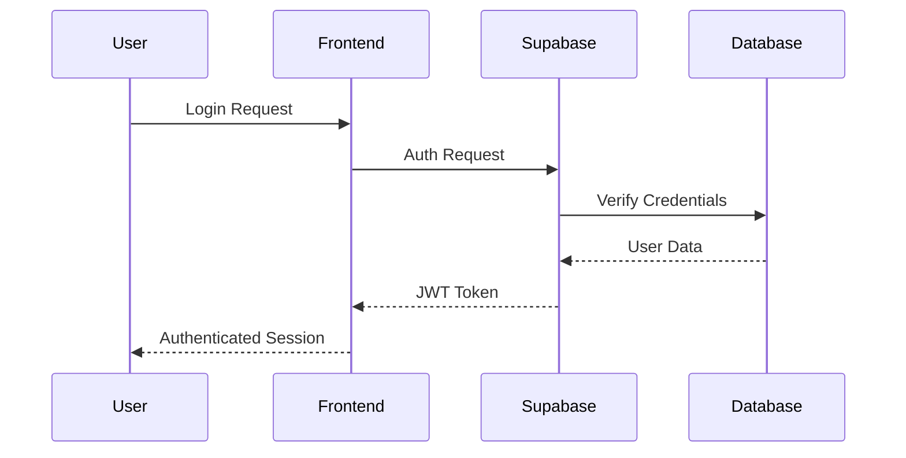
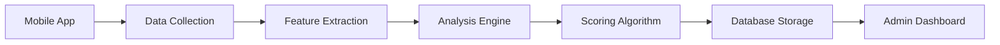

# Backend

The Mind Measure Core backend is built on Aurora Serverless v2 with AWS services, providing a secure, scalable, and HIPAA-compliant foundation for the institutional mental health platform.

## Aurora AWS Architecture

### Core Components

- **Aurora Serverless v2 PostgreSQL** - Auto-scaling database with 99.99% uptime
- **AWS Cognito** - Enterprise authentication and user management
- **AWS RDS Security** - Database-level encryption and access control
- **AWS Lambda Functions** - Serverless backend logic
- **API Gateway** - Real-time data access
- **AWS S3** - Encrypted file and media storage

### Aurora Database Configuration

All applications use a unified Aurora database configuration:

```typescript
// src/services/database/BackendServiceFactory.ts
import { BackendServiceFactory } from './BackendServiceFactory'

// Aurora Serverless v2 configuration
const config = BackendServiceFactory.getEnvironmentConfig()
export const backendService = BackendServiceFactory.createService(config)

// Current production setup
// VITE_BACKEND_PROVIDER=aws-rds
// VITE_DB_HOST=mindmeasure-aurora.cluster-cz8c8wq4k3ak.eu-west-2.rds.amazonaws.com
```

## AWS Lambda Functions

AWS Lambda Functions provide serverless backend logic for operations that require elevated privileges or complex processing.

### Function Categories

1. **Authentication & Authorization**
   - User role management
   - Institution membership handling
   - Permission validation

2. **Data Processing**
   - Assessment scoring and analysis
   - Feature extraction from user data
   - Analytics computation

3. **Institutional Operations**
   - Bulk user management
   - Institution setup and configuration
   - Report generation

4. **System Administration**
   - Health checks and monitoring
   - Data migration and cleanup
   - Backup and recovery operations

### Edge Function Structure

```typescript
// supabase/functions/example-function/index.ts
import { serve } from "https://deno.land/std@0.168.0/http/server.ts"
import { createClient } from 'https://esm.sh/@supabase/supabase-js@2'

serve(async (req) => {
  try {
    // Initialize Supabase client with service role
    const supabase = createClient(
      Deno.env.get('SUPABASE_URL') ?? '',
      Deno.env.get('SUPABASE_SERVICE_ROLE_KEY') ?? ''
    )

    // Function logic here
    const result = await processRequest(req, supabase)

    return new Response(JSON.stringify(result), {
      headers: { 'Content-Type': 'application/json' },
    })
  } catch (error) {
    return new Response(JSON.stringify({ error: error.message }), {
      status: 500,
      headers: { 'Content-Type': 'application/json' },
    })
  }
})
```

## Environment Configuration

### Environment Variables

**Public Variables** (Safe for client-side)
```bash
NEXT_PUBLIC_SUPABASE_URL=your_supabase_project_url
NEXT_PUBLIC_SUPABASE_ANON_KEY=your_supabase_anon_key
```

**Private Variables** (Server-side only)
```bash
SUPABASE_SERVICE_ROLE_KEY=your_service_role_key
SUPABASE_JWT_SECRET=your_jwt_secret
```

### Environment Rules

1. **Never expose service role keys** in client-side code
2. **Use environment-specific configurations** for different deployments
3. **Validate all environment variables** at startup
4. **Use TypeScript types** for environment variable validation

## Security Architecture

### Authentication Flow



### Row Level Security (RLS)

RLS policies enforce data access at the database level:

```sql
-- Example RLS Policy
CREATE POLICY "Users can view own profile" ON profiles
  FOR SELECT USING (auth.uid() = id);

CREATE POLICY "Admins can view institution users" ON profiles
  FOR SELECT USING (
    EXISTS (
      SELECT 1 FROM memberships 
      WHERE user_id = auth.uid() 
      AND institution_id = profiles.institution_id
      AND role IN ('admin', 'superadmin')
    )
  );
```

### API Security

1. **JWT Token Validation** - All requests validated against Supabase Auth
2. **Rate Limiting** - Prevent abuse and DoS attacks
3. **Input Validation** - Sanitize all user inputs
4. **CORS Configuration** - Restrict cross-origin requests
5. **Audit Logging** - Track all administrative actions

## Data Processing Pipeline

### Assessment Processing



### Feature Extraction

The backend processes multi-modal data from the mobile app:

1. **Audio Analysis** - Speech patterns and emotional indicators
2. **Text Analysis** - Sentiment and content analysis
3. **Behavioral Data** - Usage patterns and engagement metrics
4. **Assessment Responses** - Structured questionnaire data

### Analytics Engine

- **Real-time Processing** - Immediate insights for administrators
- **Batch Processing** - Comprehensive reports and trends
- **Privacy-Preserving Analytics** - Aggregated data without individual identification
- **Institutional Comparisons** - Benchmarking against peer institutions

## Performance Optimization

### Database Optimization

1. **Indexing Strategy** - Optimized queries for common access patterns
2. **Connection Pooling** - Efficient database connections
3. **Query Optimization** - Minimize database load
4. **Caching** - Frequently accessed data caching

### Edge Function Optimization

1. **Cold Start Minimization** - Optimize function startup time
2. **Memory Management** - Efficient resource usage
3. **Timeout Handling** - Graceful handling of long-running operations
4. **Error Recovery** - Robust error handling and retry logic

## Monitoring and Observability

### Application Monitoring

- **Error Tracking** - Comprehensive error logging and alerting
- **Performance Metrics** - Response times and throughput monitoring
- **Usage Analytics** - Privacy-compliant usage statistics
- **Health Checks** - System status monitoring

### Security Monitoring

- **Authentication Events** - Login attempts and security events
- **Access Patterns** - Unusual access pattern detection
- **Data Breach Detection** - Automated security incident detection
- **Compliance Reporting** - Audit trails for regulatory compliance

## Backup and Recovery

### Data Protection

1. **Automated Backups** - Regular database snapshots
2. **Point-in-Time Recovery** - Restore to specific timestamps
3. **Cross-Region Replication** - Geographic data redundancy
4. **Disaster Recovery** - Complete system restoration procedures

### Business Continuity

- **High Availability** - 99.9% uptime SLA
- **Load Balancing** - Automatic traffic distribution
- **Failover Procedures** - Seamless service continuation
- **Recovery Time Objectives** - Defined recovery timeframes

## Development and Testing

### Local Development

```bash
# Start Supabase locally
supabase start

# Run migrations
supabase db reset

# Generate types
supabase gen types typescript --local > packages/supabase/types/database.ts
```

### Testing Strategy

1. **Unit Tests** - Individual function testing
2. **Integration Tests** - End-to-end workflow testing
3. **Security Tests** - Penetration testing and vulnerability scanning
4. **Performance Tests** - Load testing and optimization validation

## Deployment and Scaling

### Production Deployment

- **Supabase Cloud** - Managed infrastructure
- **Automatic Scaling** - Dynamic resource allocation
- **Global CDN** - Worldwide content delivery
- **SSL/TLS** - Encrypted data transmission

### Scaling Considerations

- **Database Scaling** - Vertical and horizontal scaling options
- **Function Scaling** - Automatic concurrency handling
- **Storage Scaling** - Unlimited storage capacity
- **Performance Monitoring** - Continuous optimization
