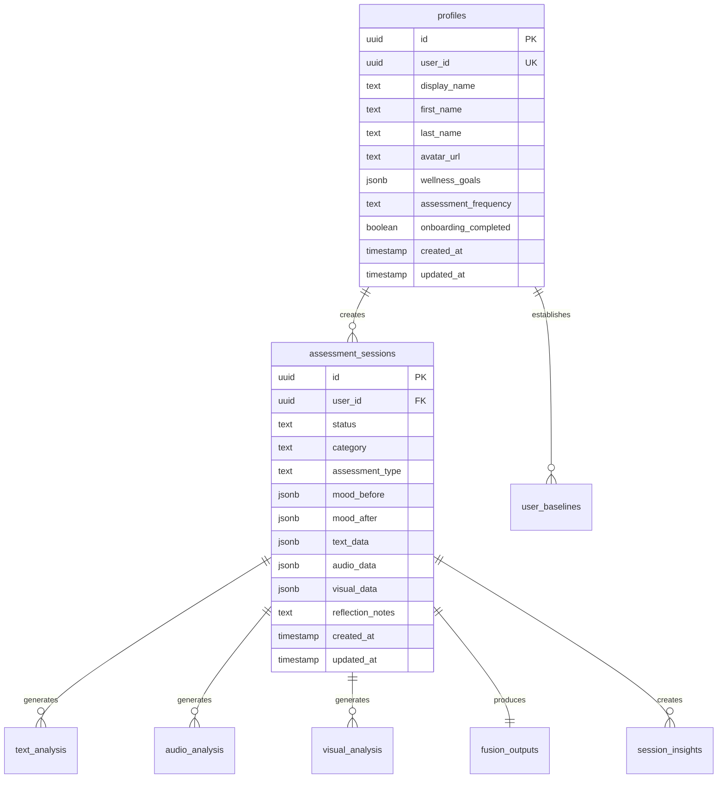

# Database Schema Documentation

This document provides comprehensive documentation for the MindMeasure PostgreSQL database schema, including tables, relationships, indexes, and security policies.

## Schema Overview

The MindMeasure database is designed around a multi-modal assessment system that tracks user wellness through various data points while maintaining strict privacy and security controls.

### Core Entities



---

## Scoring-related Tables

- user_feature_baselines
  - Columns: id, user_id, feature_name, mean, sd, created_at, updated_at
  - RLS: System ALL; Users can INSERT/UPDATE/SELECT their own
- user_calibration
  - Columns: id, user_id, modality, a, b, n_points, created_at, updated_at
  - RLS: System ALL; Users can SELECT their own

## Table Definitions

### profiles
**Purpose**: Stores user profile information and preferences

```sql
CREATE TABLE public.profiles (
    id UUID NOT NULL DEFAULT gen_random_uuid() PRIMARY KEY,
    user_id UUID NOT NULL UNIQUE,
    display_name TEXT,
    first_name TEXT,
    last_name TEXT,
    avatar_url TEXT,
    wellness_goals JSONB DEFAULT '[]'::jsonb,
    assessment_frequency TEXT DEFAULT 'weekly'::text,
    onboarding_completed BOOLEAN DEFAULT false,
    created_at TIMESTAMP WITH TIME ZONE NOT NULL DEFAULT now(),
    updated_at TIMESTAMP WITH TIME ZONE NOT NULL DEFAULT now()
);
```

**Indexes**
```sql
CREATE UNIQUE INDEX idx_profiles_user_id ON profiles(user_id);
CREATE INDEX idx_profiles_created_at ON profiles(created_at);
```

**Triggers**
```sql
CREATE TRIGGER update_profiles_updated_at
    BEFORE UPDATE ON profiles
    FOR EACH ROW
    EXECUTE FUNCTION update_updated_at_column();
```

**RLS Policies**
```sql
-- Users can view their own profile
CREATE POLICY "Users can view their own profile" 
ON profiles FOR SELECT 
USING (auth.uid() = user_id);

-- Users can create their own profile
CREATE POLICY "Users can create their own profile" 
ON profiles FOR INSERT 
WITH CHECK (auth.uid() = user_id);

-- Users can update their own profile
CREATE POLICY "Users can update their own profile" 
ON profiles FOR UPDATE 
USING (auth.uid() = user_id);
```

**JSON Schema - wellness_goals**
```typescript
interface WellnessGoals {
  goals: Array<{
    id: string;
    title: string;
    description?: string;
    category: 'sleep' | 'stress' | 'mood' | 'energy' | 'focus' | 'social';
    priority: 'low' | 'medium' | 'high';
    target_date?: string;
    completed: boolean;
    created_at: string;
  }>;
}
```

---

### assessment_sessions
**Purpose**: Central table for all assessment sessions and their metadata

```sql
CREATE TABLE public.assessment_sessions (
    id UUID NOT NULL DEFAULT gen_random_uuid() PRIMARY KEY,
    user_id UUID,
    status TEXT NOT NULL DEFAULT 'pending'::text,
    category TEXT DEFAULT 'general'::text,
    assessment_type TEXT DEFAULT 'full'::text,
    mood_before JSONB,
    mood_after JSONB,
    text_data JSONB,
    audio_data JSONB,
    visual_data JSONB,
    reflection_notes TEXT,
    created_at TIMESTAMP WITH TIME ZONE NOT NULL DEFAULT now(),
    updated_at TIMESTAMP WITH TIME ZONE NOT NULL DEFAULT now()
);
```

**Indexes**
```sql
CREATE INDEX idx_sessions_user_id ON assessment_sessions(user_id);
CREATE INDEX idx_sessions_status ON assessment_sessions(status);
CREATE INDEX idx_sessions_user_date ON assessment_sessions(user_id, created_at DESC);
CREATE INDEX idx_sessions_type ON assessment_sessions(assessment_type);
```

**Check Constraints**
```sql
ALTER TABLE assessment_sessions 
ADD CONSTRAINT check_status_valid 
CHECK (status IN ('pending', 'processing', 'completed', 'failed'));

ALTER TABLE assessment_sessions 
ADD CONSTRAINT check_assessment_type_valid 
CHECK (assessment_type IN ('full', 'quick', 'voice-only'));
```

**RLS Policies**
```sql
-- Users can view their own sessions
CREATE POLICY "Users can view their own assessment sessions" 
ON assessment_sessions FOR SELECT 
USING (auth.uid() = user_id);

-- Users can create their own sessions
CREATE POLICY "Users can create their own assessment sessions" 
ON assessment_sessions FOR INSERT 
WITH CHECK (auth.uid() = user_id);

-- Users can update their own sessions
CREATE POLICY "Users can update their own assessment sessions" 
ON assessment_sessions FOR UPDATE 
USING (auth.uid() = user_id);
```

**JSON Schemas**

*mood_before/mood_after*
```typescript
interface MoodData {
  emotional_state: {
    primary: string;
    secondary?: string;
    intensity: number; // 1-10
  };
  energy_level: number; // 1-10
  stress_level: number; // 1-10
  sleep_quality?: number; // 1-10
  physical_comfort: number; // 1-10
  social_connection: number; // 1-10
  notes?: string;
  timestamp: string;
}
```

*text_data*
```typescript
interface TextData {
  transcripts?: string[];
  user_input?: string;
  conversation_data?: any[];
  processing_metadata?: {
    source: 'manual' | 'voice_transcript' | 'chat';
    quality_score?: number;
    language?: string;
  };
}
```

---

### text_analysis
**Purpose**: Stores AI analysis results for text-based assessment data

```sql
CREATE TABLE public.text_analysis (
    id UUID NOT NULL DEFAULT gen_random_uuid() PRIMARY KEY,
    session_id UUID NOT NULL,
    combined_text TEXT,
    sentiment_analysis JSONB,
    cognitive_markers JSONB,
    linguistic_patterns JSONB,
    text_wellness_score NUMERIC,
    processed_at TIMESTAMP WITH TIME ZONE NOT NULL DEFAULT now()
);
```

**Indexes**
```sql
CREATE INDEX idx_text_analysis_session ON text_analysis(session_id);
CREATE INDEX idx_text_analysis_score ON text_analysis(text_wellness_score);
CREATE INDEX idx_text_analysis_processed ON text_analysis(processed_at);
```

**RLS Policies**
```sql
-- System can create analysis
CREATE POLICY "System can create text analysis" 
ON text_analysis FOR INSERT 
WITH CHECK (true);

-- Users can view their own analysis
CREATE POLICY "Users can view their own text analysis" 
ON text_analysis FOR SELECT 
USING (EXISTS (
    SELECT 1 FROM assessment_sessions 
    WHERE assessment_sessions.id = text_analysis.session_id 
    AND assessment_sessions.user_id = auth.uid()
));
```

**JSON Schemas**

*sentiment_analysis*
```typescript
interface SentimentAnalysis {
  overall_sentiment: 'positive' | 'negative' | 'neutral';
  confidence: number;
  emotional_tone: string;
  mood_indicators: string[];
  sentiment_scores: {
    positive: number;
    negative: number;
    neutral: number;
  };
}
```

*cognitive_markers*
```typescript
interface CognitiveMarkers {
  clarity_score: number;
  coherence_score: number;
  thought_patterns: string[];
  cognitive_load: number;
  focus_indicators: string[];
  decision_making_patterns: string[];
}
```

---

### audio_analysis
**Purpose**: Stores analysis results from voice and audio processing

```sql
CREATE TABLE public.audio_analysis (
    id UUID NOT NULL DEFAULT gen_random_uuid() PRIMARY KEY,
    session_id UUID NOT NULL,
    transcription TEXT,
    vocal_characteristics JSONB,
    prosodic_features JSONB,
    emotional_markers JSONB,
    audio_wellness_score NUMERIC,
    processed_at TIMESTAMP WITH TIME ZONE NOT NULL DEFAULT now()
);
```

**Indexes**
```sql
CREATE INDEX idx_audio_analysis_session ON audio_analysis(session_id);
CREATE INDEX idx_audio_analysis_score ON audio_analysis(audio_wellness_score);
```

**JSON Schemas**

*vocal_characteristics*
```typescript
interface VocalCharacteristics {
  pitch_mean: number;
  pitch_variance: number;
  speaking_rate: number;
  volume_mean: number;
  voice_quality: string;
  breath_patterns: {
    frequency: number;
    regularity: number;
  };
}
```

*prosodic_features*
```typescript
interface ProsodicFeatures {
  rhythm_stability: number;
  stress_patterns: string[];
  intonation_patterns: string[];
  pause_patterns: {
    frequency: number;
    duration_mean: number;
    placement: string[];
  };
}
```

---

### visual_analysis
**Purpose**: Stores analysis results from visual/facial expression processing

```sql
CREATE TABLE public.visual_analysis (
    id UUID NOT NULL DEFAULT gen_random_uuid() PRIMARY KEY,
    session_id UUID NOT NULL,
    facial_expressions JSONB,
    micro_expressions JSONB,
    emotional_indicators JSONB,
    visual_wellness_score NUMERIC,
    processed_at TIMESTAMP WITH TIME ZONE NOT NULL DEFAULT now()
);
```

**JSON Schemas**

*facial_expressions*
```typescript
interface FacialExpressions {
  primary_emotions: Array<{
    emotion: string;
    confidence: number;
    duration: number;
  }>;
  expression_changes: Array<{
    timestamp: number;
    from_emotion: string;
    to_emotion: string;
  }>;
  overall_expressiveness: number;
}
```

---

### fusion_outputs
**Purpose**: Comprehensive wellness scores using fusion model with probabilities

```sql
CREATE TABLE public.fusion_outputs (
    session_id UUID NOT NULL PRIMARY KEY,
    user_id UUID NOT NULL,
    p_worse_fused DOUBLE PRECISION NOT NULL,
    p_worse_audio DOUBLE PRECISION,
    p_worse_visual DOUBLE PRECISION, 
    p_worse_text DOUBLE PRECISION,
    p_worse_passive DOUBLE PRECISION,
    score INTEGER NOT NULL,
    score_smoothed DOUBLE PRECISION NOT NULL,
    uncertainty DOUBLE PRECISION NOT NULL,
    qc_overall TEXT NOT NULL DEFAULT 'reliable',
    drivers JSONB,
    model_version TEXT NOT NULL DEFAULT 'v1.0',
    created_at TIMESTAMP WITH TIME ZONE NOT NULL DEFAULT now()
);
```

**Indexes**
```sql
CREATE INDEX idx_scores_session ON mind_measure_scores(session_id);
CREATE INDEX idx_scores_combined ON mind_measure_scores(combined_score);
CREATE INDEX idx_scores_calculated ON mind_measure_scores(calculated_at);
CREATE INDEX idx_scores_baseline ON mind_measure_scores(is_baseline_session, calculated_at);
```

**JSON Schemas**

*baseline_comparison*
```typescript
interface BaselineComparison {
  deviation: number;
  significance: 'low' | 'medium' | 'high';
  trend: 'improving' | 'stable' | 'declining';
  confidence_level: number;
  comparison_period: {
    start_date: string;
    end_date: string;
    session_count: number;
  };
}
```

*trend_analysis*
```typescript
interface TrendAnalysis {
  short_term: string; // Last 7 days
  medium_term: string; // Last 30 days
  long_term: string; // Last 90 days
  patterns: string[];
  correlations: Array<{
    factor: string;
    correlation: number;
    confidence: number;
  }>;
}
```

---

### session_insights
**Purpose**: AI-generated insights and recommendations from assessment sessions

```sql
CREATE TABLE public.session_insights (
    id UUID NOT NULL DEFAULT gen_random_uuid() PRIMARY KEY,
    session_id UUID NOT NULL,
    key_concerns JSONB DEFAULT '[]'::jsonb,
    emotional_themes JSONB DEFAULT '{}'::jsonb,
    conversation_summary TEXT,
    notable_changes TEXT,
    follow_up_topics JSONB DEFAULT '[]'::jsonb,
    created_at TIMESTAMP WITH TIME ZONE NOT NULL DEFAULT now()
);
```

**JSON Schemas**

*key_concerns*
```typescript
interface KeyConcerns {
  concerns: Array<{
    concern: string;
    category: string;
    severity: 'low' | 'medium' | 'high';
    mentioned_count: number;
    first_mentioned: string;
    context: string;
  }>;
}
```

*emotional_themes*
```typescript
interface EmotionalThemes {
  themes: {
    [theme: string]: {
      frequency: number;
      intensity: number;
      context: string[];
      trend: 'increasing' | 'stable' | 'decreasing';
    };
  };
}
```

---

### user_baselines
**Purpose**: Personal wellness baselines for each user across different metrics

```sql
CREATE TABLE public.user_baselines (
    id UUID NOT NULL DEFAULT gen_random_uuid() PRIMARY KEY,
    user_id UUID NOT NULL,
    metric_type TEXT NOT NULL,
    baseline_score NUMERIC NOT NULL,
    confidence_level NUMERIC NOT NULL DEFAULT 0.5,
    sample_count INTEGER NOT NULL DEFAULT 0,
    created_at TIMESTAMP WITH TIME ZONE NOT NULL DEFAULT now(),
    last_updated TIMESTAMP WITH TIME ZONE NOT NULL DEFAULT now()
);
```

**Indexes**
```sql
CREATE UNIQUE INDEX idx_baselines_user_metric ON user_baselines(user_id, metric_type);
CREATE INDEX idx_baselines_updated ON user_baselines(last_updated);
```

**Metric Types**
- `combined_wellness`: Overall wellness score
- `audio_wellness`: Voice-based wellness indicators
- `text_wellness`: Text-based wellness indicators
- `visual_wellness`: Visual-based wellness indicators
- `mood_stability`: Emotional stability tracking
- `stress_levels`: Stress pattern baselines

---

## Database Functions

### update_updated_at_column()
**Purpose**: Automatically updates the `updated_at` timestamp on record modification

```sql
CREATE OR REPLACE FUNCTION public.update_updated_at_column()
RETURNS TRIGGER AS $$
BEGIN
    NEW.updated_at = now();
    RETURN NEW;
END;
$$ LANGUAGE plpgsql;
```

### handle_new_user()
**Purpose**: Automatically creates a profile for new users

```sql
CREATE OR REPLACE FUNCTION public.handle_new_user()
RETURNS TRIGGER
LANGUAGE plpgsql
SECURITY DEFINER
SET search_path TO ''
AS $$
BEGIN
    INSERT INTO public.profiles (user_id, display_name, first_name, last_name)
    VALUES (
        NEW.id,
        COALESCE(NEW.raw_user_meta_data ->> 'display_name', NEW.email),
        NEW.raw_user_meta_data ->> 'first_name',
        NEW.raw_user_meta_data ->> 'last_name'
    );
    RETURN NEW;
END;
$$;
```

---

## Database Triggers

### Profile Triggers
```sql
-- Auto-update timestamp on profile changes
CREATE TRIGGER update_profiles_updated_at
    BEFORE UPDATE ON profiles
    FOR EACH ROW
    EXECUTE FUNCTION update_updated_at_column();

-- Auto-create profile for new users
CREATE TRIGGER on_auth_user_created
    AFTER INSERT ON auth.users
    FOR EACH ROW
    EXECUTE FUNCTION handle_new_user();
```

### Session Triggers
```sql
-- Auto-update timestamp on session changes
CREATE TRIGGER update_sessions_updated_at
    BEFORE UPDATE ON assessment_sessions
    FOR EACH ROW
    EXECUTE FUNCTION update_updated_at_column();
```

---

## Security & Privacy

### Row Level Security (RLS)

All tables have RLS enabled with policies ensuring:
- Users can only access their own data
- System functions can create analysis records
- No direct user access to sensitive analysis data
- Audit trail for all data access

### Data Encryption

**At Rest**
- PostgreSQL transparent data encryption
- Sensitive JSONB fields use application-level encryption
- Backup encryption with rotating keys

**In Transit**
- TLS 1.3 for all database connections
- Certificate pinning for additional security
- Connection pooling with encrypted channels

### Data Retention

**Automated Policies**
```sql
-- Example: Archive old sessions after 2 years
CREATE OR REPLACE FUNCTION archive_old_sessions()
RETURNS void AS $$
BEGIN
    -- Move to archive table
    INSERT INTO assessment_sessions_archive 
    SELECT * FROM assessment_sessions 
    WHERE created_at < NOW() - INTERVAL '2 years';
    
    -- Delete from main table
    DELETE FROM assessment_sessions 
    WHERE created_at < NOW() - INTERVAL '2 years';
END;
$$ LANGUAGE plpgsql;
```

---

## Performance Optimization

### Indexing Strategy

**Primary Indexes**
- All foreign keys are indexed
- Date fields for temporal queries
- Score fields for analysis queries
- Composite indexes for common query patterns

**Query Optimization**
```sql
-- Optimized query for user dashboard
EXPLAIN (ANALYZE, BUFFERS) 
SELECT s.*, ms.combined_score, ms.baseline_deviation
FROM assessment_sessions s
LEFT JOIN mind_measure_scores ms ON s.id = ms.session_id
WHERE s.user_id = $1 
ORDER BY s.created_at DESC 
LIMIT 10;
```

### Partitioning

**Time-based Partitioning** for large tables
```sql
-- Partition assessment_sessions by month
CREATE TABLE assessment_sessions_y2024m01 PARTITION OF assessment_sessions
FOR VALUES FROM ('2024-01-01') TO ('2024-02-01');
```

---

## Backup & Recovery

### Backup Strategy
- **Point-in-time recovery**: 7-day retention
- **Daily full backups**: 30-day retention
- **Weekly archive backups**: 1-year retention
- **Annual compliance backups**: 7-year retention

### Recovery Procedures
```sql
-- Example: Restore specific user data
BEGIN;
-- Restore from backup timestamp
SELECT * FROM backup_restore_user_data('user_uuid', '2024-01-01 12:00:00');
COMMIT;
```

---

## Migration Guidelines

### Schema Changes
1. Always use migrations for schema changes
2. Test migrations on staging data
3. Plan for zero-downtime deployments
4. Document breaking changes

### Version Control
```sql
-- Migration versioning example
-- V001__initial_schema.sql
-- V002__add_user_baselines.sql
-- V003__enhance_analysis_tables.sql
```

This database schema supports the comprehensive mental wellness assessment platform while maintaining strict security, privacy, and performance standards.