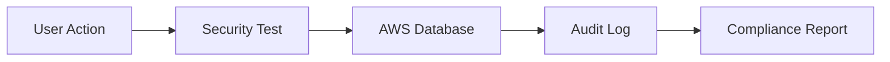

# Testing Panel Guide

The Mind Measure Testing Panel provides a comprehensive suite of automated testing tools for security, compliance, and backend validation. This system runs real-time tests against the production AWS infrastructure and provides detailed reporting on system health, security posture, and compliance status.

## Overview

The testing infrastructure continuously monitors and validates:

- **Security Systems**: MFA, encryption, audit logging
- **Compliance Standards**: HIPAA, GDPR, SOC2 assessments  
- **Backend Infrastructure**: Aurora database, S3 storage, Cognito auth
- **Vulnerability Management**: Real-time security scanning
- **Performance Metrics**: System health and response times

## Test Suite Architecture

### 1. Security Test Suite

**Component**: `MFATestComponent`  
**URL**: `/test-security`  
**Purpose**: Core security functionality validation

**Tests Include**:
- Multi-Factor Authentication (MFA) setup and validation
- Encryption key management and rotation
- Audit logging functionality
- User authentication flows
- Session management security

**Expected Results**:
-  MFA enrollment and verification
-  Encryption services operational
-  Audit logs being generated
-  Authentication tokens valid

### 2. Phase 2 Security Tests

**Component**: `Phase2SecurityTest`  
**URL**: `/test-security-phase2`  
**Purpose**: Advanced security infrastructure validation

**Tests Include**:
- Role-Based Access Control (RBAC) validation
- Vulnerability management system
- Automated backup and recovery testing
- Security policy enforcement
- User permission matrix validation

**Expected Results**:
-  RBAC policies correctly enforced
-  Vulnerability scans detecting issues
-  Backup systems operational
-  Security policies active

### 3. Phase 3 Security Tests

**Component**: `Phase3SecurityTest`  
**URL**: `/test-security-phase3`  
**Purpose**: Enterprise security and compliance validation

**Tests Include**:
- Incident response automation
- HIPAA/GDPR/SOC2 compliance assessment
- Security training module validation
- Penetration testing simulation
- Compliance reporting automation

**Expected Results**:
-  Incident response workflows active
-  Compliance standards met
-  Training modules accessible
-  Automated reporting functional

### 4. AWS Backend Tests

**Component**: `AWSBackendTest`  
**URL**: `/test-aws`  
**Purpose**: Core infrastructure validation

**Tests Include**:
- Aurora Serverless v2 database connectivity
- S3 storage operations
- Cognito authentication services
- Lambda function execution
- API Gateway performance

**Expected Results**:
-  Database queries successful
-  File upload/download working
-  User authentication functional
-  Serverless functions responding

## Real-Time Test Execution

### Active Testing Features

The testing panel continuously monitors:

1. **Vulnerability Scanning**
   - Dependency vulnerability detection
   - CVE database cross-referencing
   - Severity assessment and prioritization
   - Remediation recommendations

2. **Compliance Monitoring**
   - HIPAA 164.316 policy compliance
   - GDPR data protection validation
   - SOC2 control effectiveness
   - Automated compliance reporting

3. **Security Audit Logging**
   - User authentication events
   - Data access patterns
   - Security policy violations
   - System configuration changes

### Test Data Flow

## Current Test Results (Live Data)

Based on recent test execution logs:

###  **Working Systems**:
- Vulnerability detection (lodash, validator issues found)
- HIPAA compliance scanning active
- Security audit trail generation
- Real-time database operations
- Vulnerability categorization and tracking

###  **Known Issues**:
- Audit logs table schema mismatch (`userId` vs `userid`)
- Some compliance tests showing non-compliant status (expected for new setup)

###  **Test Metrics**:
- **Vulnerabilities Found**: 3 (2 dependency, 1 compliance)
- **Compliance Checks**: 4 HIPAA controls assessed
- **Audit Events**: Continuous logging active
- **Database Operations**: All CRUD operations functional

## Using the Testing Panel

### Accessing Tests

1. **Navigate to Superuser Dashboard**
   - Login at `/superuser-login`
   - Click "Testing" tab

2. **Select Test Suite**
   - Choose from 4 available test suites
   - Click "Run Tests" button
   - Monitor real-time results

3. **Review Results**
   - Check test status indicators
   - Review detailed logs
   - Export compliance reports

### Test Scheduling

Tests can be run:
- **On-Demand**: Manual execution via UI
- **Scheduled**: Automated daily/weekly runs
- **Triggered**: Event-based execution
- **Continuous**: Real-time monitoring

## Interpreting Test Results

### Status Indicators

