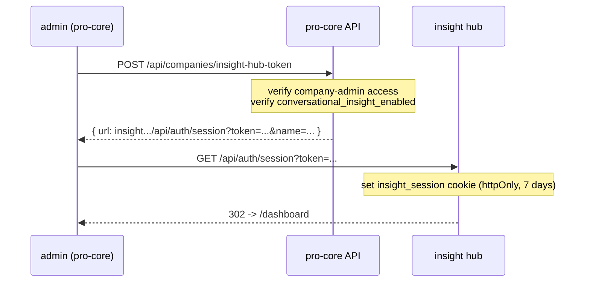

# Architecture

The Insight Hub is a thin presentation layer over Conversational Insight logic that already lives in `mind-measure-pro-core`. Nothing in the hub queries the database for business data directly except for branding and the entitlement check — everything else is proxied.

---

## Repos & domains

| Piece | Repo | Domain | Stack |
|---|---|---|---|
| Insight Hub app | `mind-measure-pro-insight-hub` | `insight.mindmeasurepro.com` | Next.js 16 App Router, React 19, `pg`, inline styles |
| Backend + admin | `mind-measure-pro-core` | `admin.mindmeasurepro.com` | React + Vite SPA, Vercel serverless `/api/*` |
| Question asking | `mind-measure-pro-mobile` | `mobile.mindmeasurepro.app` | Capacitor + React, ElevenLabs check-in |
| Voice agent | ElevenLabs | — | Per-institution Jodie agent |

The hub deliberately mirrors the `mind-measure-pro-hub` (Content Hub) stack so there is no new technology to maintain.

---

## Authentication

There are **two** ways into the hub. Both end with the same `insight_session` cookie, and both re-validate the per-company entitlement flag on every request.

### Path 1 — Admin SSO handoff (primary)

This is how Mind Measure staff and company admins already inside `admin.mindmeasurepro.com` reach the hub.



The token is a base64-encoded JSON payload `{ email, companyId, companyName, role, ts }`. It is **not signed** — it is a short-lived handoff artefact, and the hub re-validates entitlement server-side on every page load, so a forged token cannot reach data: `getInsightUser()` re-queries `companies.conversational_insight_enabled` and fails closed.

The SSO cookie lives for **7 days** (`maxAge: 60 * 60 * 24 * 7`).

### Path 2 — Passwordless front door

The hub also has its own sign-in page at `/login`, so an institution's HR analytics team can land directly on `insight.mindmeasurepro.com` without going through admin first.

It reuses pro-core's existing 6-digit email-code stack rather than reinventing auth:

1. `POST /api/auth/email-login/request` → forwards to pro-core `send-access-code` (mints a hashed-code JWT challenge, SES-emails the code, rate-limited per IP).
2. `POST /api/auth/email-login/verify` → forwards to pro-core `verify-access-code`, then applies **two hub-side gates** before issuing a cookie:
   - **No `companyId`** on the verified user → 403 ("Mind Measure staff: sign in via admin and use the *Open Insight Hub* sidebar link"). Staff have platform-wide scope, not a single company.
   - **`conversational_insight_enabled = false`** → 403 ("Insight Hub isn't enabled for *that company*. Contact your Mind Measure account manager.").

Only if both gates pass is the `insight_session` cookie set, here with a **24-hour** expiry.

### `getInsightUser()`

Every hub page and every hub API route resolves the session through `src/lib/auth.ts`:

1. Read the `insight_session` cookie; absent → no user.
2. Decode the base64 JSON payload.
3. Re-query Aurora for `companies` by `id` or `slug`, selecting branding fields **and** `conversational_insight_enabled`.
4. If the flag is `false`, return `null` (fail closed) — even with a valid cookie.

This is the single chokepoint that makes the entitlement flag authoritative on every request rather than only at login.

---

## Hub → pro-core bridge auth

The hub's API routes do not hold database credentials for business data. They call pro-core over HTTP, authenticated with a **short-lived bridge JWT**:

- Minted in `src/lib/upstream.ts` with `INSIGHT_HUB_BRIDGE_SECRET`, `issuer: 'mindmeasure-insight-hub'`, ~60s lifetime.
- Verified in pro-core's `api/_lib/auth-middleware.ts` (`verifyInsightHubBridgeToken`).
- The `companyId` is pinned from the session on the hub side, so a hub client cannot request another tenant's data.

---

## Gating

A single column controls entitlement:

```sql
ALTER TABLE companies
  ADD COLUMN conversational_insight_enabled BOOLEAN NOT NULL DEFAULT FALSE;
```

| Flag | Sidebar launch card (admin) | `insight-hub-token` | Hub pages | Email login |
|---|---|---|---|---|
| `false` | hidden | 403 | bounce to admin | 403 with message |
| `true` | rendered | issues token | served | allowed |

The flag is set per company by a Mind Measure superuser (`api/admin/enable-sgr-insight.ts` and similar). Tiered pricing is deferred — one reversible boolean matches what we actually know about pricing today.

Access *within* the hub is governed by `resolveCompanyAdmin()` in pro-core (`api/_lib/company-admin.ts`), which exposes `canEnterInsightHub`, `canViewInsightData` and `canEditInsightData`.

---

## Hub → pro-core proxy map

Every data route on the hub forwards to a pro-core endpoint, with `companyId` injected from the session:

| Hub route | Method | pro-core endpoint |
|---|---|---|
| `/api/questions` | GET / POST / PATCH | `/api/companies/questions` |
| `/api/question-responses` | GET | `/api/companies/question-responses` |
| `/api/question-responses-timeline` | GET | `/api/companies/question-responses-timeline` |
| `/api/questions-reach-estimate` | POST | `/api/companies/questions-reach-estimate` |
| `/api/cross-question-themes` | GET | `/api/companies/cross-question-themes` |
| `/api/question-cohort-divergence` | GET | `/api/companies/question-cohort-divergence` |
| `/api/cohort-insight-report` | POST | `/api/companies/cohort-insight-report` |
| `/api/branding` | GET | `/api/companies/public-branding` |
| `/api/auth/email-login/request` | POST | pro-core `send-access-code` |
| `/api/auth/email-login/verify` | POST | pro-core `verify-access-code` (+ local gates) |
| `/api/auth/session` · `/logout` · `/me` | GET | local cookie handling only |

See the [API Reference](/insight-hub/api-reference) for what each pro-core endpoint computes.

---

## Data flow at a glance

1. **Author** a question in the hub → pro-core stores it on `institutional_questions` and calls `syncAgentForCompany()` to push the active question set into the institution's ElevenLabs agent prompt.
2. **Check-in** on mobile → Jodie raises questions naturally during the conversation.
3. **Capture** → after the check-in, mobile fires `POST /api/agents/questions/responses`, which sends the transcript to Bedrock, paraphrases per-question answers, and writes anonymised rows to `institutional_question_responses`.
4. **Read** → the hub reads aggregates back through its proxies; pro-core enforces the k-anonymity floor and runs Bedrock summarisation on the read path.

The full mechanism — including the difference between the shipped agent-prompt path and the designed per-check-in resolver — is documented in [How Questions Are Asked](/insight-hub/asking-questions).
