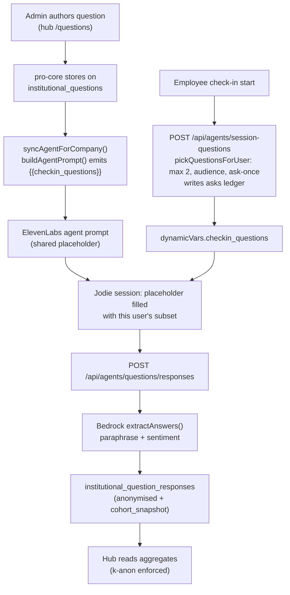

# How Questions Are Asked

This is the heart of the feature: the journey from an admin typing a question to an anonymised theme appearing on the dashboard. It runs across four systems — the hub (authoring), pro-core (storage + agent sync + aggregation), ElevenLabs (the conversation), and the mobile app (the check-in).

import { Callout } from 'nextra/components'

<Callout type="info">
**Selection and delivery are two different jobs.** Keeping them apart is the key to understanding the mechanism:

- **Selection (server-side):** a per-check-in resolver, `pickQuestionsForUser`, picks at most **two** questions for the user — cohort-matched and never previously asked — and records the asks. This cannot live in the conversation: it needs the user's profile and the `institutional_question_asks` ledger.
- **Delivery (context channel):** the chosen questions are handed to Jodie as the `checkin_questions` dynamic variable, which fills a `{{checkin_questions}}` placeholder in the agent prompt — the same per-check-in context channel that already carries division, department and seniority.

This replaces the original v1 model (every active question baked into one shared prompt). It takes effect once pro-core is deployed, the institutional agents are re-synced, and the updated mobile build ships.
</Callout>

---

## Step 1 — Authoring (hub `/questions`)

An admin composes a question in the hub's question library (`QuestionsClient`). A question carries:

- **Question text** — the natural-language prompt Jodie may raise.
- **Internal note / context** — guidance never spoken to the user.
- **Priority** — `required` or `optional`.
- **Audience** — `{ all: true }` by default, or a cohort filter built with the `AudiencePicker` (the same picker Alerts uses).
- **Active window** — optional `active_from` / `active_until`.

Before publishing a cohort-targeted question, the hub calls the **reach estimate** (`questions-reach-estimate`). If fewer than five people match, publish is blocked with *"Broaden the filters before publishing"* — the k-anonymity floor applied up front so a narrow audience can never be created in the first place.

The library is split into **Live / Drafts / Archived**. There is no per-organisation cap on how many questions exist; the protection is per-user exposure (see the resolver below). A soft warning appears at 50 active questions and a hard cap at 200 (`HARD_CAP_ACTIVE`) guards against runaway misconfiguration.

> Question authoring now lives in the hub's `QuestionsClient`. The legacy `CustomQuestionsManager.tsx` in pro-core is fully implemented but no longer mounted in the CMS — the in-CMS Questions tab was retired when the hub launched.

---

## Step 2 — Storage + agent sync (pro-core)

`POST` / `PATCH /api/companies/questions` validates the `audience` via `parseAudience()` and writes to `institutional_questions`. On any publish, edit or archive of an *active* question, pro-core calls **`syncAgentForCompany()`**, which rebuilds the institution's ElevenLabs agent prompt and pushes it with `updateAgentPrompt()`.

Crucially, `buildAgentPrompt()` (in `InstitutionalAgentService.ts`) does **not** embed the literal questions. When the institution has any active questions it emits one static framing block carrying a placeholder:

```text
During this check-in, your institution would like you to weave in the
following question(s) if — and only if — the conversation invites them
naturally:
{{checkin_questions}}
If nothing is listed above, do not introduce any extra questions...
```

<Callout type="info">
**One shared prompt, per-user content.** The stored prompt is identical for every user; the `{{checkin_questions}}` placeholder is filled per check-in with the subset the resolver picked for that individual (Step 3). Because the questions are no longer baked in, cohort targeting and the per-user "ask at most two, never re-ask" rotation are enforced for real in the conversation — not just reflected on the dashboard.
</Callout>

---

## Step 3 — Per-check-in resolution

At check-in start, before the ElevenLabs session begins, the mobile app calls **`POST /api/agents/session-questions`**. That endpoint resolves the caller server-side (the Cognito `sub`, which equals `profiles.user_id`), looks up their company from their own profile, and runs **`pickQuestionsForUser`** (`api/_lib/questions.ts`):

1. Select active questions for the institution within their active window.
2. **Drop** any question that already has a row in `institutional_question_asks` for this user — *silence is honoured exactly like an answer*.
3. **Filter** by `audience` using `profileMatchesAudience()` against the user's profile.
4. Sort `required` before `optional`, then oldest first.
5. Take at most **two** (default `limit = 2`, clamped 1–5).
6. **Atomically insert** the picked questions into `institutional_question_asks` (`ON CONFLICT DO NOTHING`) — *before* the user speaks.

The endpoint returns the picked questions pre-formatted as a short list. The mobile sets that on `dynamicVars.checkin_questions` and starts the session, so the `{{checkin_questions}}` placeholder resolves to this user's subset. If the call fails for any reason it falls back to an empty string — a resolver error can never block a check-in; the conversation simply proceeds with no custom questions.

Three principles drive this:

- **Per-user, per-check-in ceiling of two.** No matter how large the library, a single check-in only ever offers two candidates. The conversation stays a conversation.
- **Asked-once, then rotate off — even if unanswered.** Recording the ask at resolution time (not "Jodie verbalised it") is conservative by design: if a question was put in front of Jodie for a user, that user has had their chance. We never pester. The cost is that a user might occasionally "miss" a question Jodie never found room for; the benefit is we never re-ask.
- **Selection runs server-side.** Audience matching needs the user's profile and the asks ledger, which the server has and the agent must not — keeping PII (and the full question library) out of the conversation is a wellbeing-protection principle. Delivery rides the existing dynamic-variable channel, so no per-session prompt override (and no "allow prompt overrides" agent setting) is required.

<Callout type="warning">
**The check-in path is production.** The mobile call to `session-questions` sits immediately before `conversation.startSession`. It is guarded so any failure degrades to "no custom questions" rather than disrupting the check-in. Do not change the conversation flow further without explicit sign-off.
</Callout>

---

## Step 4 — Response capture (mobile → pro-core)

After the fusion result is saved, the mobile app fires a fire-and-forget request:

```ts
await fetch('https://admin.mindmeasurepro.com/api/agents/questions/responses', {
  method: 'POST',
  headers: { Authorization: `Bearer ${token}` },
  body: JSON.stringify({ fusionOutputId: savedId }),
});
```

`POST /api/agents/questions/responses` then:

1. Verifies the caller owns the `fusion_output`.
2. Loads all active questions for the company.
3. Loads the conversation transcript from `assessment_transcripts`.
4. Calls **Bedrock (Claude 3 Haiku)** via `extractAnswers()` — for each question it decides whether the transcript answered it, and if so produces a **paraphrase**, a **sentiment** label, and a **confidence**.
5. Inserts one row per answered question into `institutional_question_responses`, with a `cohort_snapshot` of the user's profile dimensions at answer time — and **no `user_id`** (the column was dropped in migration 030).

The paraphrase is the only thing stored. The raw transcript fragment is never persisted to the insight tables.

---

## Step 5 — Aggregation & read (pro-core → hub)

When the hub renders, pro-core computes aggregates on the read path. The key endpoints:

| Endpoint | Produces |
|---|---|
| `question-responses` | Per-question `asked`, `total` (answered), sentiment buckets, up to 3 paraphrased samples, and a Bedrock summary once there are enough responses |
| `question-responses-timeline` | Daily response counts per question (for sparklines) |
| `cross-question-themes` | Corpus-level Bedrock theme extraction across all active questions → "discussed" + "emerging" buckets ("Voice of the workforce") |
| `question-cohort-divergence` | Question × cohort-value matrix from `cohort_snapshot`, scored by how far cohorts diverge |
| `cohort-insight-report` | A full per-cohort report (sentiment, themes, quotes) with a Bedrock executive summary and recommendations |

Bedrock is used on both the **write path** (`extractAnswers`) and the **read path** (`summariseResponses`, theme extraction, the cohort report). Theme/summary failures degrade gracefully — the UI shows "AI summary unavailable right now" rather than erroring.

Every one of these read paths enforces the k-anonymity floor. See [Privacy & Anonymity](/insight-hub/privacy).

---

## End-to-end summary


