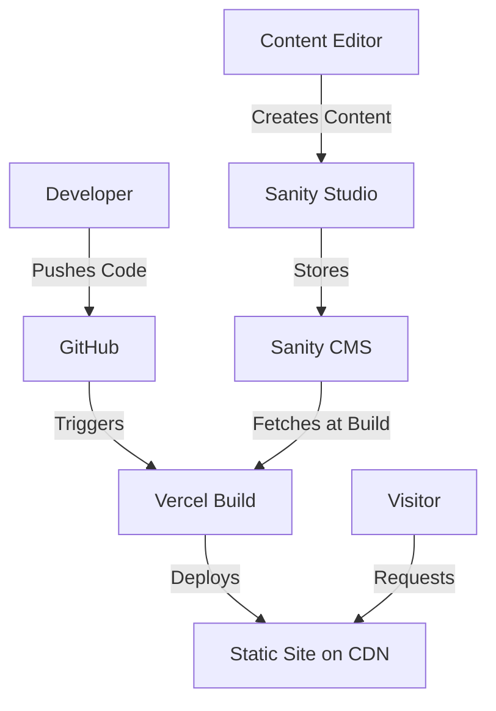

# Marketing Sites Architecture

## System Overview

The Mind Measure marketing sites are built as a **monorepo** containing multiple Astro-based static sites that share common components and utilities while maintaining independent deployments.

## Domain Structure

### Complete Platform Domains

| Domain | Type | Purpose | Repository |
|--------|------|---------|------------|
| **mindmeasure.co.uk** | Marketing | University/Institution site | mindmeasure-marketing |
| **mindmeasure.app** | Marketing | Student site | mindmeasure-marketing |
| **admin.mindmeasure.co.uk** | Admin | Admin dashboard | mind-measure-core |
| **mobile.mindmeasure.app** | Mobile App | Student mobile app | mind-measure-mobile-final |
| **docs.mindmeasure.co.uk** | Documentation | This site | mind-measure-docs |
| **investors.mindmeasure.co.uk** | Marketing | Investor relations | mind-measure_investors_new |

## Monorepo Structure

The marketing sites use an npm workspaces monorepo:

```
mindmeasure-marketing/
├── sites/              # Individual sites (independent deployments)
│   ├── university/     # mindmeasure.co.uk
│   ├── student/        # mindmeasure.app
│   └── workplace/      # [2026] Mind Measure Pro
│
└── packages/
    └── shared/         # Shared code (components, utils, types)
```

### Benefits

- **Code Reuse**: 80% of components shared across sites
- **Independent Deployment**: Each site deploys separately
- **Type Safety**: Shared TypeScript types
- **Consistent Design**: Shared styles and utilities
- **Easy Scaling**: Add new sites (e.g., workplace) without duplication

## Technology Stack

### Frontend Framework
- **Astro 5.7+**: Static site generation with partial hydration
- **Islands Architecture**: Only interactive components load JavaScript
- **Zero-JS by Default**: HTML/CSS only, JS added when needed

### Content Management
- **Sanity.io**: Headless CMS
- **Separate Projects**: Each site has its own Sanity project
- **Shared Schemas**: Common content types (blogs, whitepapers)
- **Portable Text**: Rich content editing

### Styling
- **Tailwind CSS 4**: Utility-first CSS framework
- **Design Tokens**: Shared color palette and typography
- **Responsive**: Mobile-first approach

### Deployment
- **Vercel**: Edge network hosting
- **Independent Projects**: Each site is a separate Vercel project
- **Automatic Deploys**: Push to main = automatic deployment
- **Preview Deploys**: Every PR gets a preview URL

## Data Flow



### Build Process

1. **Code Push**: Developer pushes to GitHub
2. **Webhook**: GitHub triggers Vercel build
3. **Fetch Content**: Build fetches latest content from Sanity
4. **Generate Pages**: Astro generates static HTML pages
5. **Deploy**: Pages deployed to Vercel edge network
6. **Live**: Site available globally via CDN

### Content Updates

When content is updated in Sanity:
- **Manual Rebuild**: Trigger rebuild in Vercel dashboard
- **Webhook** (coming soon): Sanity auto-triggers rebuild
- **On-Demand ISR** (future): Incremental static regeneration

## Component Architecture

### Shared Components

Located in `packages/shared/components/`:

```typescript
// Example: BlogCard component
---
interface Props {
  title: string;
  excerpt: string;
  image: string;
  slug: string;
  date: string;
  author: Author;
}

const { title, excerpt, image, slug, date, author } = Astro.props;
---

<article class="blog-card">
  
  <h3>{title}</h3>
  <p>{excerpt}</p>
  <a href={`/blog/${slug}`}>Read more</a>
</article>
```

### Site-Specific Components

Each site can override or extend shared components:

```
sites/university/src/components/
├── HeroUniversity.astro    # University-specific hero
├── PricingTable.astro      # University-specific pricing
└── TestimonialsCarousel.astro
```

## Deployment Strategy

### Per-Site Deployment

Each site is a separate Vercel project with its own:
- **Domain**: Unique production domain
- **Environment Variables**: Site-specific config
- **Build Settings**: Customized build commands
- **Analytics**: Separate tracking

### Deployment Commands

```bash
# University site
cd sites/university
npx vercel --prod
# → Deploys to mindmeasure.co.uk

# Student site
cd sites/student
npx vercel --prod
# → Deploys to mindmeasure.app
```

### Vercel Configuration

Each site has `vercel.json`:

```json
{
  "buildCommand": "npm run build",
  "outputDirectory": "dist",
  "framework": "astro"
}
```

## Performance Optimization

### Static Generation
- All pages pre-rendered at build time
- Near-instant page loads
- Excellent SEO

### Asset Optimization
- Images optimized via Astro Image
- WebP format with fallbacks
- Lazy loading for below-fold images

### Code Splitting
- Per-page JavaScript bundles
- Only load what's needed
- Shared vendor chunks

### CDN Distribution
- Vercel edge network (70+ locations)
- Automatic caching
- Gzip/Brotli compression

## Security

### Content Security
- Sanity API uses read-only tokens in frontend
- Write tokens kept in Vercel environment variables
- CORS configured for specific origins

### Domain Security
- HTTPS enforced
- Modern TLS configuration
- Security headers via Vercel

### Form Security
- Spam protection (Turnstile/reCAPTCHA)
- Rate limiting on submission endpoints
- Server-side validation

## Monitoring

### Performance Monitoring
- Vercel Analytics built-in
- Real User Monitoring (RUM)
- Core Web Vitals tracking

### Error Tracking
- Client-side errors logged
- Build failures alert team
- Deployment status notifications

### Content Analytics
- Page views per content
- Popular blog posts
- Download tracking for whitepapers

## Future Architecture Plans

### 2025 Q1
- Implement ISR (Incremental Static Regeneration)
- Add Sanity webhook for auto-rebuilds
- Optimize image pipeline further

### 2025 Q2
- A/B testing infrastructure
- Personalization based on visitor type
- Enhanced analytics integration

### 2026
- Add Mind Measure Pro (Workplace) site
- Implement multi-language support
- Advanced SEO features

---

**Architecture Version**: 1.0  
**Last Updated**: December 16, 2024

